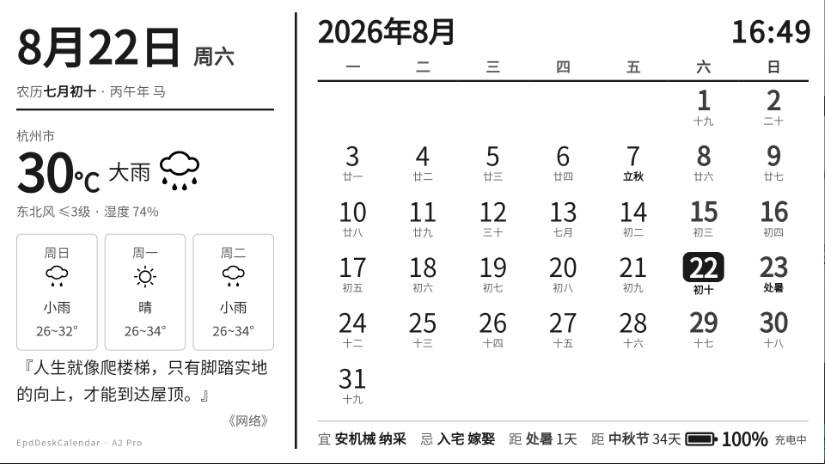
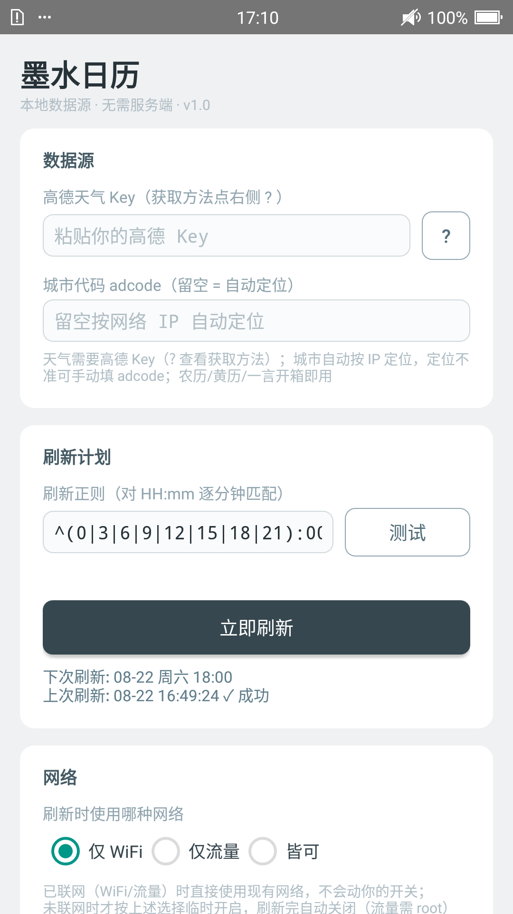
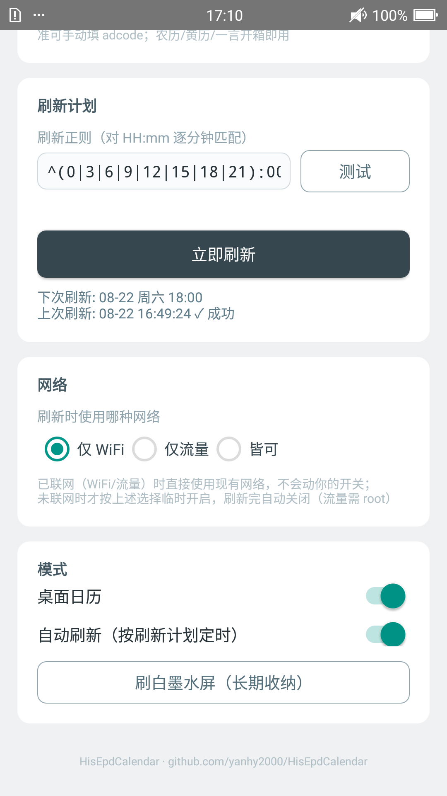

# HisEpdCalendar — 海信 A2 Pro 墨水屏桌面日历

把一台闲置的**海信 A2 Pro**（双屏手机：5.5" OLED 前屏 + 5.2" 1080×1920 墨水屏后屏）
改造成横版墨水屏桌面日历时钟。

> 项目前提：使用海信 A2 Pro 机型，已解锁 BL 并安装 Magisk（方法可参考我写的文章：https://yanhy.top/index.php/archives/437/）
> 项目由AI大量辅助开发，部分逻辑代码已经过人工审查。如不放心可拉取项目到本地审查并手动构建，除签名密钥外均相同可复现。也欢迎提issue建议和fork后自行开发

**核心思路：显示管线全部复用原厂**——原厂锁屏引擎每分钟闹钟唤醒 → 读壁纸文件 →
上屏 → 回 suspend，自研部分只负责"画什么"。锁屏状态下唯一功耗就是原厂引擎的
分钟级局部刷新，壁纸内容按计划（默认每 3 小时）本地组装渲染，联网窗口仅约 10 秒。

**完全本地化，仅需调用接口** 天气直连高德 API（用户自己的免费 Key，
城市按 IP 自动定位）、一言走免费公开 API、农历/黄历/节气/干支全部本地计算
（内置 lunar-java）。

## 效果预览

**墨水屏锁屏**（横握视角。月历/农历黄历/天气/一言为壁纸内容，定时刷新；
右上时间与右下电池由模块每分钟实时叠绘）：



**控制台 App**（卡片式配置，即改即存；点 ? 一键查看高德 Key 获取指引）：

| 数据源 / 刷新计划 | 网络 / 模式 |
|:---:|:---:|
|  |  |

## 功能一览

- 横版日历壁纸（月历 + 农历/节气/黄历/节假日休班 + 天气实况预报 + 一言）
- **实时时钟 / 实时电池**（含充电闪电）：由 Xposed hook 每分钟随引擎现场叠绘，
  壁纸几小时一换、时间却分钟级准，零额外唤醒
- 去除原厂锁屏迷你钟 / 解锁条 / 电池角标（布局铺满）
- **本地数据源**：高德天气 Key 自备（App 内一键指引），adcode 按 IP 自动定位
  （可手动覆盖），一言/农历开箱即用
- **智能网络策略**：已联网直接用且绝不动你的网络开关；未联网时按
  仅 WiFi / 仅流量 / 皆可（自动切换）临时开启，刷完只关自己开过的
- 控制台 App：卡片式界面，Key/城市/刷新正则（对 `HH:mm` 逐分钟匹配，`8:00` 与
  `08:00` 等效）即改即存、立即刷新、解析测试、自动刷新与调试日志开关
- **刷新链自愈（v1.0.2）**：引擎看门狗 + 用户级保险闹钟（`setAlarmClock`，App 被
  系统强停清闹钟也牵连不到）+ 空白渲染守卫，断链后 1 分钟内自动恢复
- 软开关：关闭「桌面日历模式」一分钟内还原原厂界面（免重启）；「刷白墨水屏」
  供长期收纳
- **单 APK 双角色**：控制台 App 与 Xposed 模块合为一体，一次构建一次部署

## 系统架构

```
┌─ 手机端 com.hi.epdcalendar（本仓库 epdcalendar-app/，数据全部本地组装）──┐
│ DataProvider：天气=高德直连(30min缓存/IP定位城市)  一言=免费API          │
│   农历黄历=lunar-java 本地计算（无网络）                                 │
│ NetPolicy：已联网直接用；否则按模式临时开 WiFi/流量，用完只关自己开的    │
│ RefreshService：自愈引擎设置 → 网络 → 组装 → 渲染 → 落位 → 布防下一轮   │
│   RenderActivity 内 WebView 渲染 960×540 CSS @2x → 1920×1080            │
│   → 顺时针转90° → 1080×1920 PNG → su 原子落位                           │
│ ScheduleLogic：正则计划器 + AlarmManager 精确闹钟                        │
└──────────────┬──────────────────────────────────────────────┘
               │ 文件级交接：/sdcard/eink_clock/eink_lockscreen_wallpaper.png
┌──────────────▼ 原厂锁屏引擎 + 本仓库 Xposed hook（同 APK 内）──────────┐
│ EInkLockScreenEngine（原厂，分钟闹钟循环）                              │
│ hook：drawWallpaper → 画我们的壁纸 + 实时时钟/电池                      │
│       showMiniClock → no-op；getBottomBar → 原图直返                   │
└──────────────────────────────────────────────────────────────────────┘
```

## 目录结构

| 路径 | 内容 |
|---|---|
| `epdcalendar-app/src/com/hi/epdcalendar/` | 控制台 App：刷新流水线、本地数据源（DataProvider）、网络策略（NetPolicy）、天气图标映射（WeatherIcons）、定时计划、渲染宿主、su 落位、卡片 UI |
| `epdcalendar-app/src/com/hi/epdclock/` | Xposed hook（与 App 同 APK；装载进锁屏引擎与 system_server，不引用 App 类） |
| `epdcalendar-app/src/com/nlf/` | lunar-java（6tail，MIT）：农历/节气/干支/黄历/法定节假日 |
| `epdcalendar-app/xposed-stubs/` | Xposed API 编译桩（仅编译期，不进 dex；运行时由框架提供） |
| `epdcalendar-app/assets/template/` | 渲染模板与 38 个天气 SVG 图标（和风风格代码） |
| `tools/build.py` | 构建/部署：`--install` 装机补权限，`--deploy` 加 modules.list 同步+重启验证 |
| `tools/render_preview.py` | PC 端模板预览（Playwright，配合 docs/api-data-sample.json 离线开发） |
| `tools/patch_installer_v4.py` | Xposed 安装器二进制补丁脚本（配合补丁版安装器，见 docs/补丁版安装器说明.md） |
| `docs/社区部署与卸载指南.md` | **普通用户安装/卸载步骤（小白可跟做）** |
| `docs/开发指南.md` | 构建/模板/hook/本地数据源的开发说明 |
| `docs/api-data-sample.json` | 数据契约样例（模板开发自足用） |
| `THIRD_PARTY.md` | 第三方组件许可（lunar-java 等） |

所需二进制制品（Xposed 框架 zip、补丁版安装器 APK、已构建的模块 APK 等）
见本仓库 **Releases**。

## 快速开始

见 **[docs/社区部署与卸载指南.md](docs/社区部署与卸载指南.md)**。
前提：A2 Pro 已解锁 BL 并安装 Magisk。装好后只需在 App 里填一个高德 Key
（免费，App 内有获取指引），其余开箱即用。

## 已知事项

- **机型限定**：hook 目标（`com.hmct.einklockscreen.EInkLockScreenEngine`、
  `BottomBarController`）是海信 ROM 独有类，其他机型安装无效但完全无害
  （找不到类仅记一条 Xposed 日志）
- 流量通道的自动开关需要 root（App 已用 su 实现，正常按指南装好即具备）
- Xposed 安装器使用补丁版（仅改一处状态检测路径，与官方原版的差异见
  [docs/补丁版安装器说明.md](docs/补丁版安装器说明.md)）；其「下载」页指向的
  官方服务器已于 2021 年关站，主页的 ZIP 加载报错可无视

## 致谢

- [Xposed](https://github.com/rovo89/XposedInstaller)（rovo89）与
  [topjohnwu](https://github.com/Magisk-Modules-Repo/xposed) 的 systemless 打包
- [lunar-java](https://github.com/6tail/lunar-java)（6tail，MIT）农历/黄历/节假日
- 高德天气 API、[一言 hitokoto](https://v1.hitokoto.cn/)

## 许可

[MIT](LICENSE)
